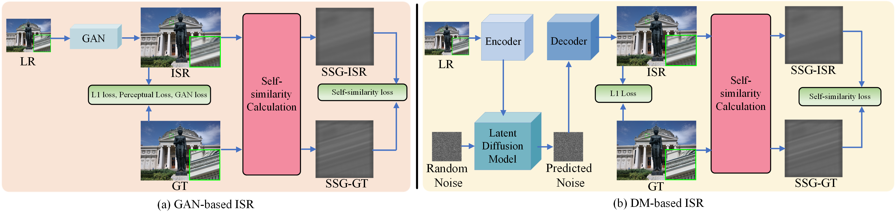
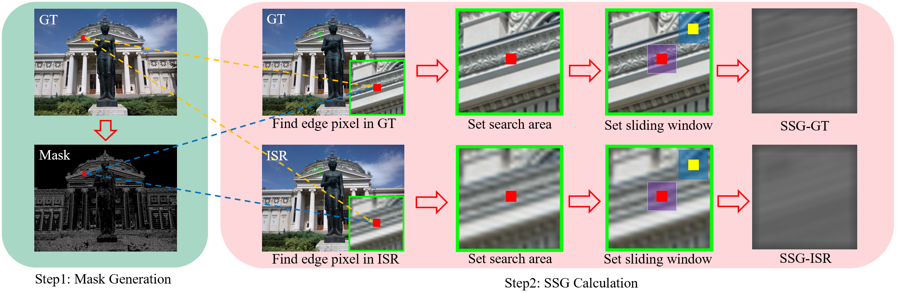

# SSL
Official PyTorch code for our Paper "SSL" in ACM MM 2024.

### [Paper and Supplementary (Arxiv Version)](https://arxiv.org/pdf/2408.05713)

> **SSL: A Self-similarity Loss for Improving Generative Image Super-resolution** <br>
> [Du CHEN\*](https://github.com/ChrisDud0257), [Zhengqiang ZHANG\*](https://github.com/xtudbxk), Jie LIANG and [Lei ZHANG](https://www4.comp.polyu.edu.hk/~cslzhang/). <br>
> Accepted by ACM MM 2024.<br>

### To be done in the future
1. Update the codes about Diffusion-based SSL methods.
2. Update the pretrained models.
3. Update the codes of metrics.

## Abstract
Generative adversarial networks (GAN) and generative diffusion models (DM) have been widely used 
in real-world image super-resolution (Real-ISR) to enhance the image perceptual quality. 
However, these generative models are prone to generating visual artifacts and false image structures, 
resulting in unnatural Real-ISR results. Based on the fact that natural images exhibit high 
self-similarities, i.e., a local patch can have many similar patches to it in the whole image, 
in this work we propose a simple yet effective self-similarity loss (SSL) to improve the performance 
of generative Real-ISR models, enhancing the hallucination of structural and textural details while 
reducing the unpleasant visual artifacts. Specifically, we compute a self-similarity graph (SSG) of 
the ground-truth image, and enforce the SSG of Real-ISR output to be close to it. To reduce the 
training cost and focus on edge areas, we generate an edge mask from the ground-truth image, and 
compute the SSG only on the masked pixels. The proposed SSL serves as a general plug-and-play 
penalty, which could be easily applied to the off-the-shelf Real-ISR models. Our experiments 
demonstrate that, by coupling with SSL, the performance of many state-of-the-art Real-ISR models, 
including those GAN and DM based ones, can be largely improved, reproducing more perceptually 
realistic image details and eliminating many false reconstructions and visual artifacts. 

## The illustration of Self-similarity Loss (SSL) when embedd into existing GAN-based or DM-based models:

 The GAN or DM network is employed to map the input LR image to an ISR output. We calculate 
the self-similarity graphs (SSG) of both ISR output and ground-truth (GT) image, 
and calculate the SSL between them to supervise the generation of image details and 
structures.


## The calculation progress of Self-similarity Graph (SSG)

We first generate a mask to indicate the image edge areas by applying the Laplacian 
Operator on the GT image. During the training period, for each edge pixel in the mask, 
we find the corresponding pixels in the GT image and ISR image, and set a search area 
centred at them. A local sliding window is utilized to calculate the similarity between 
each pixel in the search area and the central pixel so that an SSG can be respectively 
computed for the GT image and the ISR image, with which the SSL can be computed. 
The red pixel means the edge pixel, while the blue block means the sliding window.

## Core function of Self-similarity Graph (SSG)

 - PyTorch Version, you could find it [here](GAN-Based-SR/basicsr/losses/loss_util.py).
```bash
 def ssl_pytorch(self, img, mask, kernel_size_search=25, kernel_size_window=9, sigma=1.0, generalization=False):
     # img, 1*3*h*w
     # mask, 1*1*h*w
     b, c, h, w = img.shape
     # print(f"mask shape is {mask.shape}")
     _, c1, _, _ = mask.shape

     img_search_area = F.pad(input=img, pad=(
     kernel_size_search // 2, kernel_size_search // 2, kernel_size_search // 2, kernel_size_search // 2),
                             mode="reflect")
     img_search_area = F.unfold(input=img_search_area, padding=0, kernel_size=kernel_size_search,
                                stride=1)  # 1,3*k_search*k_search, h*w

     mask = F.unfold(input=mask, padding=0, kernel_size=1, stride=1)  # 1,1*1*1, h*w
     index = torch.where(mask == 1)

     img_search_area = img_search_area[:, :, index[-1]]  # 1, 3*k_search*k_search, num         num is the total amount of the pixels which is 1 in the mask
     del mask
     del index
     _, _, num = img_search_area.shape
     img_search_area = img_search_area.reshape(b, c, kernel_size_search * kernel_size_search, num)
     img_search_area = img_search_area.permute(0, 1, 3, 2)  # 1, 3, num, k_search*k_search
     img_search_area = img_search_area.reshape(b, c * num, kernel_size_search,
                                               kernel_size_search)  # 1,3*num, k_search, k_search

     img_search_area = F.unfold(input=img_search_area, kernel_size=kernel_size_window,
                                padding=kernel_size_window // 2, stride=1)  # 1, 3*num*k_c*k_c, k_s*k_s
     img_search_area = img_search_area.reshape(b, c, num, kernel_size_window * kernel_size_window,
                                               kernel_size_search * kernel_size_search)
     img_search_area = img_search_area.permute(0, 2, 1, 3, 4)  # 1, num, 3, k_c*k_c, k_s*k_s
     img_search_area = img_search_area.reshape(b, num, c * kernel_size_window * kernel_size_window,
                                               kernel_size_search * kernel_size_search)  # 1, num, c*k_c*k_c, k_s*k_s

     img_center_neighbor = img_search_area[:, :, :, (kernel_size_search * kernel_size_search) // 2].unsqueeze(
         -1)  # 1, num, c*k_c*k_c, 1

     q = img_search_area - img_center_neighbor  # 1, num, c*k_c*k_c, k_s*k_s
     # print(f"q shape is {q.shape}")
     del img_search_area
     del img_center_neighbor
     q = q.pow(2).sum(2)  # 1, num, k_s*k_s
     q = q / (c * math.pow(kernel_size_window, 2))
     q = torch.exp(-1 * q / sigma)
     if generalization:
         q = 1 / (torch.sum(q, dim=-1) + 1e-10).unsqueeze(-1) * q
     self.s = q    # self.s denotes the final SSG
     del q
```

 - CUDA version, you could find it [here](GAN-Based-SR/basicsr/losses/loss_util.py). The CUDA operator could be
found [here](GAN-Based-SR/basicsr/losses/similarity).
```bash
def ssl_cuda(self, img, mask, kernel_size_search=25, kernel_size_window=9, sigma=1.0, generalization=False):
    b,c,h,w = img.shape
    q = compute_similarity(image=img[0], mask=mask[0,0], psize=kernel_size_search, ksize=kernel_size_window)
    q = q / (c * math.pow(kernel_size_window, 2))
    q = q.unsqueeze(0)
    b, num, _, _ = q.shape
    q = q.reshape(b, num, kernel_size_search * kernel_size_search)

    q = torch.exp(-1 * q / sigma)

    if generalization:
        q = 1 / (torch.sum(q, dim=-1) + 1e-10).unsqueeze(-1) * q
    self.s = q  # self.s denotes the final SSG
    del q
```

**We strongly recommend you to use the CUDA version to largely save GPU memory during training.
If you use PyTorch version, the GPU memory cost will surpass 48G.**

## SSL for GAN-based SR.
We integrate all GAN-based SR methods into the BasicSR framework.
 - Please following the training and testing steps [here](GAN-Based-SR/README.md).

## SSL for DM-based SR.


## Other issues
We also collect some questions that might be asked. Please see bellow.

### 1.How to adjust the performance of SSL in any Generative SR models
If you want to try SSL in your own projects, maybe you need to adjust the following hyper-parameters, the hyper-parameters settings
in our paper may not be the best choice in all situations:
 - kernel size search
 - kernel size window
 - sigma (scaling factor)
 - weights of your own losses and the SSL (maybe this is the most important factor)

Note that, according to our experience, after adjusting the weight of SSL, if the magnitude of it is approximately comparable to the existing largest loss term,
then you might obtain a good performance. And, the weight should be set in an appropriate range, seting too small will have no promotion when compared with the original model, while too large might have
side effect to the optimization process.

### 2.Could SSL be embedd into non-generative SR tasks or other low-level visison tasks?
Good question. We haven't tried this in non-generative SR tasks. Since they rarely hallucinate artifacts or wrong textures, maybe SSL will have little promotion to those methods.
For other low-level vision tasks, maybe the computational of SSG should be considered twice. For example,
 - Is edge mask important in that task? If not, then what kind of mask should be chosen? Semantic mask or other mask?
 - The hyper-parameter settings.
 - The GPU memory and training time cost.

## License
This project is released under the Apache 2.0 license.

## Citation
If you find this research helpful for you, please follow us by
```bash
@inproceedings{chen2024ssl,
  title={SSL: A Self-similarity Loss for Improving Generative Image Super-resolution},
  author={Chen, Du and ZHANG, Zhengqiang and Liang, Jie and Zhang, Lei},
  booktitle={ACM Multimedia 2024}
}
```

## Acknowledgement

This project is built mainly based on the excellent [BasicSR](https://github.com/XPixelGroup/BasicSR) and [KAIR](https://github.com/cszn/KAIR) codeframe. We appreciate it a lot for their developers.

## Contact

If you have any questions or suggestions about this project, please contact me at ```csdud.chen@connect.polyu.hk``` .


